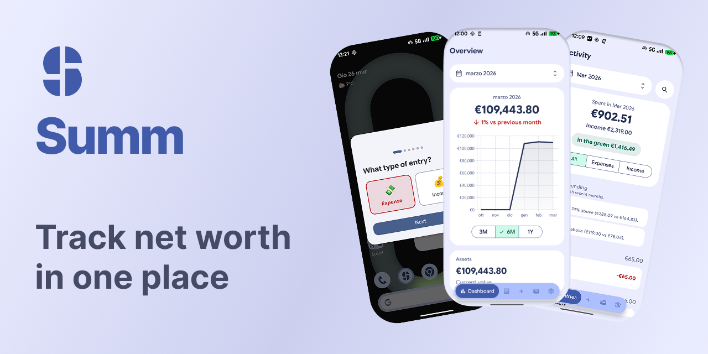
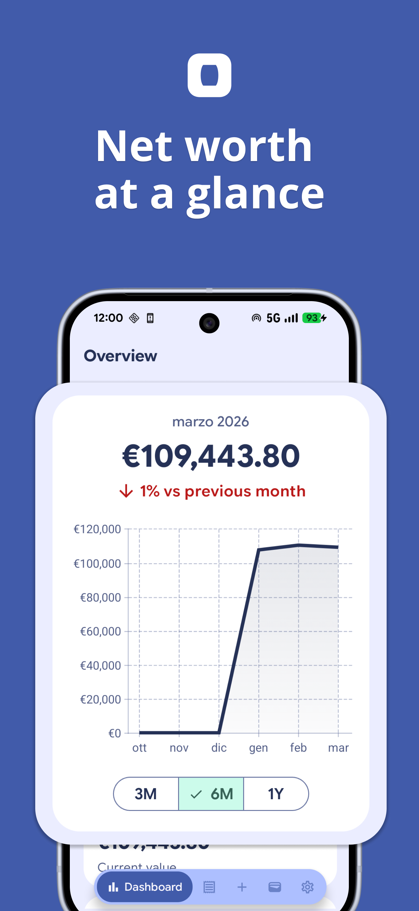
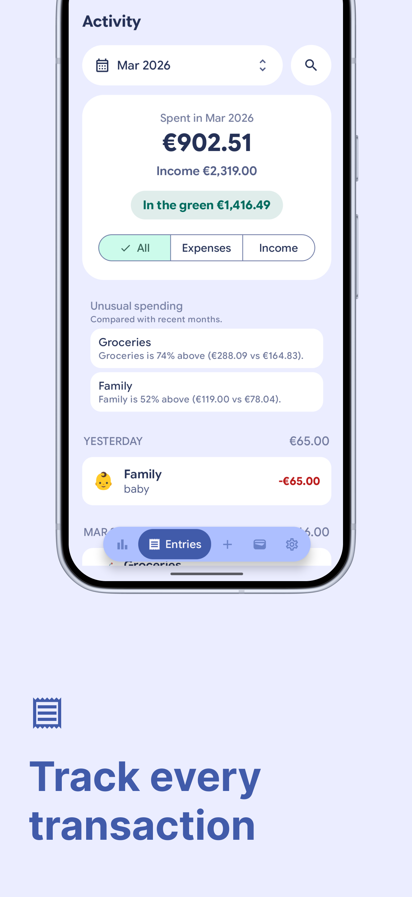
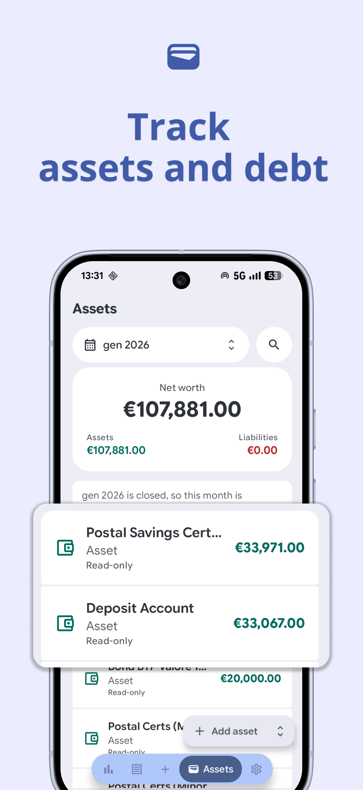
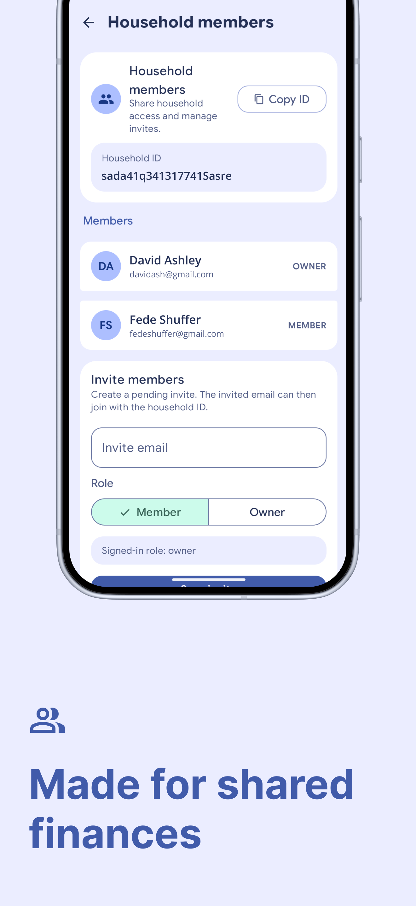
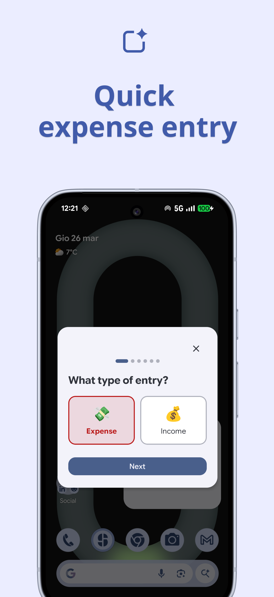
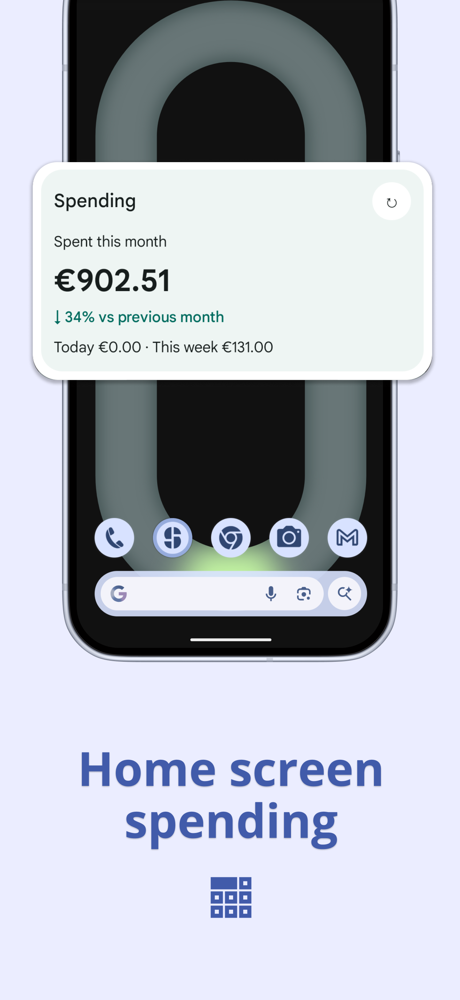
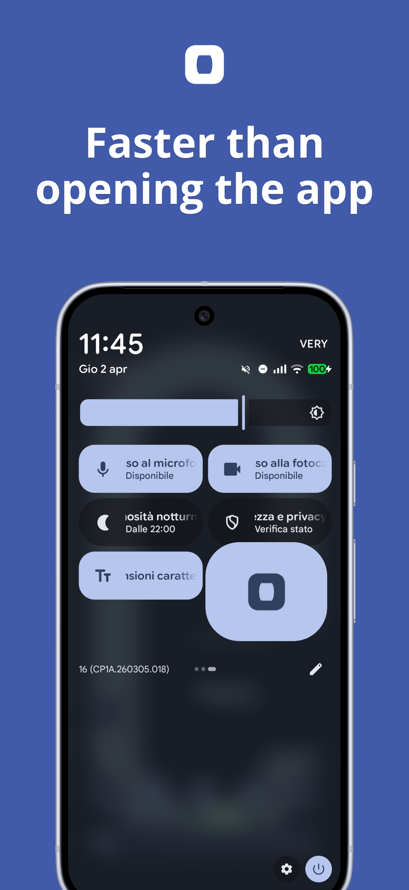
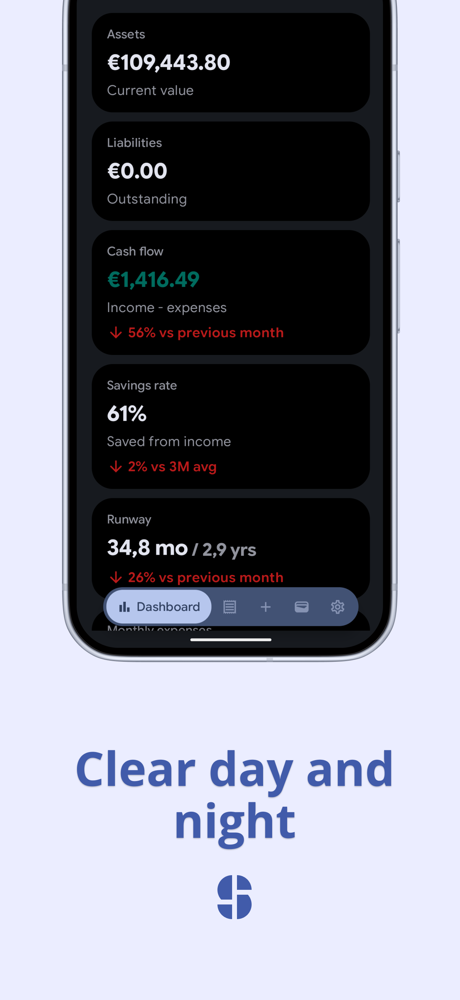

<div align="center">
  
</div>

<div id="user-content-toc">
  <ul style="list-style: none;">
    <summary>
      <h1>Summ</h1>
      <p>
      <a href="https://github.com/davideagostini/summ/releases/latest"></a>
      <a href="https://opensource.org/license/mit"></a>
      <a href="https://kotlinlang.org"></a>
    </summary>
  </ul>
</div>

Summ is a mobile-first Android app for shared household finance tracking.

It is designed for small shared workspaces such as couples or families who want a simple way to track:

- net worth
- assets and liabilities
- income and expenses
- recurring transactions
- monthly household progress

The app is intentionally not an accounting suite. The focus is fast daily use, clear numbers, and a simple shared-household model backed by Firebase.

## Screenshots

<p align="center" width="100%">

</p>

## What this repository contains

- Android app source code
- Gradle project files
- GitHub CI workflow
- contribution and release documentation

## Core product model

All financial data belongs to a `household`.

Supported roles:

- `owner`
- `member`

Both users share the same data inside a household:

- dashboard
- assets
- transactions
- categories
- recurring transactions
- month close state

Each household uses one shared currency configured from Settings. The app does not support per-asset currencies or mixed-currency totals.

## Current feature set

### Authentication and household

- Google sign-in with Firebase Authentication
- persistent session restore
- create household
- join household with invite + household ID
- owner/member household model
- household onboarding keeps the user behind a loading state until session access is fully resolved

### Dashboard

- net worth
- total assets
- total liabilities
- monthly cash flow
- savings rate
- financial runway
- 3 / 6 / 12 month net worth chart
- month selector

### Entries

- monthly transaction list
- grouped by day
- search
- `All / Expenses / Income` filter
- unusual spending insights
- entry edit and delete flow
- quick-entry flow

### Assets

- monthly asset snapshots
- assets and liabilities in one feature
- search
- edit and delete flow
- copy previous month snapshot
- monthly net worth summary
- household currency applied automatically to new asset snapshots

### Settings

- household currency
- category management
- recurring transactions
- month close
- household members
- invite management
- household details

The household currency is changed from a dedicated searchable settings screen, and the selected currency is surfaced at the top of the list.

### Quick access

- Quick Settings tile
- home-screen quick-entry widget
- home-screen spending summary widget

## Tech stack

- Kotlin
- Jetpack Compose
- Material 3
- Hilt
- Coroutines + Flow
- Firebase Authentication
- Cloud Firestore
- Navigation Compose
- Glance widgets

## Project structure

Main source root:

```text
app/src/main/java/com/davideagostini/summ
```

Top-level packages:

```text
summ/
├── data/       # Firebase access, repositories, entities, session state, DI
├── domain/     # Shared models and lightweight use cases
├── tile/       # Quick Settings tile integration
├── ui/         # Compose screens, ViewModels, state, feature components
└── widget/     # Home-screen widgets and widget data sources
```

The current app pattern is:

```text
Screen composable
  -> collects immutable state with collectAsStateWithLifecycle()
ViewModel
  -> exposes uiState + renderState
Repository / Use Case
  -> reads and writes Firebase-backed data
```

Composable screens should stay focused on rendering and screen orchestration. Derived business data such as totals, grouped lists, chart models, and filtered lists should be prepared in `ViewModel` or shared model/use-case code.

## Requirements

- Android Studio
- JDK 17
- Android SDK
- Firebase project

## Backend setup required

To actually run the app, you need your own Firebase project.

Minimum backend setup:

- Firebase Authentication with Google sign-in enabled
- Cloud Firestore created
- `app/google-services.json` added locally
- `firebase/firestore.rules` deployed
- `firebase/firestore.indexes.json` deployed

The provided Firestore rules support the initial household bootstrap flow used by the Android app:
- create household document
- create the owner membership
- seed default categories

This repository is app-first, but the Android client depends on that Firebase setup to work correctly.

## Local setup

### 1. Create a Firebase project

- Open [Firebase Console](https://console.firebase.google.com/)
- Create a new project

### 2. Register the Android app

Use this package name:

```text
com.davideagostini.summ
```

### 3. Enable Google sign-in

- Open `Authentication`
- Enable `Google`
- Set the support email if requested

### 4. Create Firestore

- Open `Firestore Database`
- Create a database
- Choose the mode you prefer for local development

### 5. Add Android SHA fingerprints

From the repository root:

```bash
cd mobile-app
./gradlew signingReport
```

Add the debug `SHA-1` and `SHA-256` fingerprints to the Android app in Firebase.

### 6. Add `google-services.json`

Download the file from Firebase and place it here:

```text
app/google-services.json
```

This file is intentionally ignored by Git.

### 7. Deploy Firestore rules and indexes

From the `mobile-app/firebase` folder:

```bash
cd mobile-app/firebase
firebase use --add
firebase deploy --only firestore:rules
firebase deploy --only firestore:indexes
```

If you prefer, you can deploy with `--project <your-project-id>` instead of setting an active project first.

### 8. Build and install

```bash
cd mobile-app
./gradlew assembleDebug
./gradlew installDebug
```

## Firestore data model

Expected structure:

```text
users/{uid}
households/{householdId}
households/{householdId}/members/{userId}
households/{householdId}/categories/{categoryId}
households/{householdId}/transactions/{transactionId}
households/{householdId}/assets/{assetId}
households/{householdId}/assets/{assetId}/history/{entryId}
households/{householdId}/recurringTransactions/{recurringTransactionId}
households/{householdId}/monthCloses/{period}
households/{householdId}/invites/{inviteId}
```

## Release signing

Create a local `keystore.properties` file by copying [`keystore.properties.example`](./keystore.properties.example) and filling in your local values.

Example:

```properties
storeFile=/absolute/path/to/your-upload-key.jks
storePassword=change-me
keyAlias=upload
keyPassword=change-me
```

Build a release bundle with:

```bash
cd mobile-app
./gradlew bundleRelease
```

The output bundle will be generated under:

```text
app/build/outputs/bundle/release/app-release.aab
```

## GitHub release automation

This repository is set up so that pushing a tag like `v0.0.5` can:

- build a signed release APK
- build a signed release AAB
- generate a release mapping file for deobfuscation
- publish both files to a GitHub Release

Required GitHub Actions secrets:

- `ANDROID_KEYSTORE_BASE64`
- `ANDROID_KEYSTORE_PASSWORD`
- `ANDROID_KEY_ALIAS`
- `ANDROID_KEY_PASSWORD`

How it works:

1. Convert your keystore to base64 locally
2. Store the value in `ANDROID_KEYSTORE_BASE64`
3. Add the other signing values as repository secrets
4. Push a tag such as:

```bash
git tag v0.0.5
git push origin v0.0.5
```

The workflow will decode the keystore, sign the release build, generate both `APK` and `AAB`, and attach them to the GitHub Release.

Release builds use minification and resource shrinking. The generated `mapping.txt` is uploaded as a GitHub Actions artifact so you can keep the deobfuscation file for Play Console or post-release analysis without exposing it in the public GitHub Release.

## Security and publishing notes

Do not commit:

- `app/google-services.json`
- `local.properties`
- `keystore.properties`
- `.jks` / `.keystore` files
- service account JSON files

If a local Firebase file was added to Git by mistake:

```bash
git rm --cached app/google-services.json
```

## Documentation

- [`CONTRIBUTING.md`](./CONTRIBUTING.md)
- [`project_overview.md`](./project_overview.md)
- [`FIRST_RELEASE_CHECKLIST.md`](./FIRST_RELEASE_CHECKLIST.md)
- [Privacy Policy](https://getsumm.app/privacy-policy)
- [Terms of Service](https://getsumm.app/terms-of-service)

## Roadmap ideas

- improved home-screen widgets
- Wear OS support
- AI-powered finance features
- import / export data
- notifications and reminders
- better backup and migration flows

## Support the project

Summ is free to use and open source. If you find it useful and want to support ongoing development, you can do it here:

- [Buy Me a Coffee](https://buymeacoffee.com/davideagostini)
- [GitHub Sponsors](https://github.com/sponsors/davideagostini)

## Star History

If you find Summ useful, consider giving the repository a star.

[](https://app.repohistory.com/star-history)

## License

This repository uses the MIT license. See [`LICENSE`](./LICENSE).
